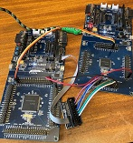
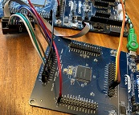
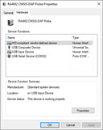

# ra-cmsis-dap-port

## Overview

This repo provides an example port of Arm's CMSIS-DAP debug probe firmware to the Renesas RA MCU family (https://www.renesas.com/ra), targeting the RA4M2 MCU fitted to an EK-RA4M2 evaluation board (https://www.renesas.com/ek-ra4m2). 

The port is provided as an RA Flexible Software Package (FSP) project for building with the e2 studio IDE.  FSP/e2 studio installers are available from https://github.com/renesas/fsp. After building the project, the resulting image can be used to turn the EK-RA4M2 board into a simple debug probe.

Background information on CMSIS-DAP can be found in Arm's documentation : https://arm-software.github.io/CMSIS_5/DAP/html/index.html

The CMSIS-DAP sources used as the basis of this port are taken from the CMSIS 5.9.0 Pack file at : https://github.com/ARM-software/CMSIS_5/releases

## Port Details

### CMSIS-DAP Version
This port is based on the CMSIS-DAP 2.1.1 sources from the CMSIS 5.9.0 Pack file. SWO support is not included currently.

### VCOM
The port provides a VCOM (virtual COM) port, allowing a UART to USB bridge link from the target device'a UART to the host PC via the CMSIS-DAP Probe.

### VID / PID 
The port is configured to use USB VID = 0x45B and PID = 0x201F. This is the Renesas VID and PID reserved for this CMSIS-DAP port.

### LED Usage
The port uses the LEDs fitted to the EK-RA4M2 as follows:
* Red (R33) : Probe Active
* Green (R34): DAP Command in progress
* Blue (R32) : VCOM Active

### Pin Usage
The following connections need to be made between the EK-RA4M2 and the target board:
| EK-RA4M2 | Target Board |
| -------- | ------------ |
| GND | GND |
| BSP_IO_PORT_01_PIN_13 | UARTTX |
| BSP_IO_PORT_01_PIN_12 | UARTRX |
| BSP_IO_PORT_04_PIN_02| PIN_CMSIS_DAP_SWCLK |
| BSP_IO_PORT_04_PIN_03 | PIN_CMSIS_DAP_RESET |
| BSP_IO_PORT_04_PIN_06 | PIN_CMSIS_DAP_SWDIO |
| BSP_IO_PORT_04_PIN_10 | PIN_CMSIS_DAP_NTRST |
| BSP_IO_PORT_04_PIN_11	| PIN_CMSIS_DAP_TDI |
| BSP_IO_PORT_04_PIN_12	| PIN_CMSIS_DAP_TDO |

Due to the pitch of the pins on a standard Cortex-M debug header, you may find it easier to use an adapter to allow use of a "normal" debug cable for plugging into the target board, such as Embedded Artists' 10-pin to 20-pin JTAG Adapter (https://www.embeddedartists.com/products/10-pin-to-20-pin-jtag-adapter/)

### Pictures
The below show an EK-RA4M2 board being used as a CMSIS-DAP debug probe for debugging an EK-RA4M3 board :

 

The below show the board as it appears in Windows 10 Devices and Printers:

 

### Tools
The project is currently intended to be built using FSP 4.3.0 and e2 studio 2023-01, available from https://github.com/renesas/fsp/releases/tag/v4.3.0.

It has been tested with a variety of RA Family MCUs using 
* Keil MDK 5.38a in conjunction with the Renesas RA CMSIS Device Family Pack (DFP) providing device support including flash loaders.
* IAR EWARM 9.32.x (using IAR flash loaders).
* PyOCD 0.34.1 (using flash loaders from the RA DFP).
